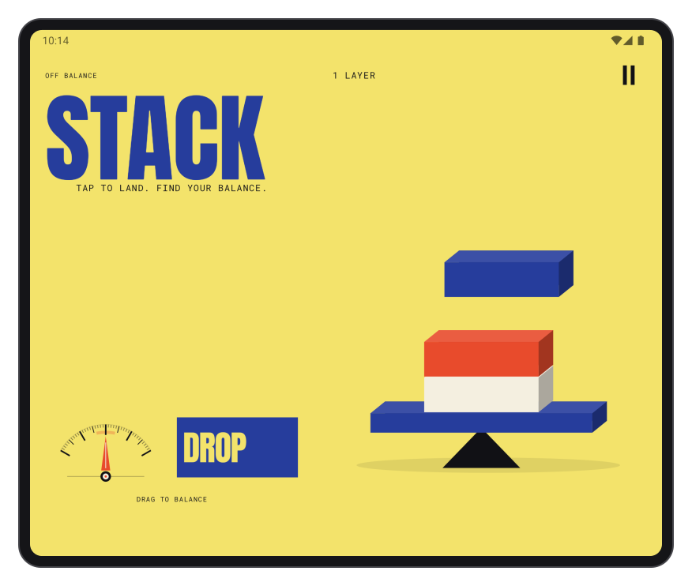
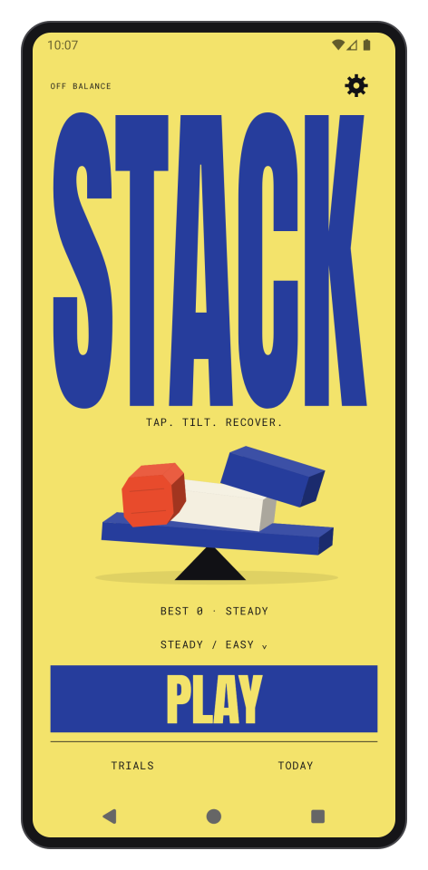
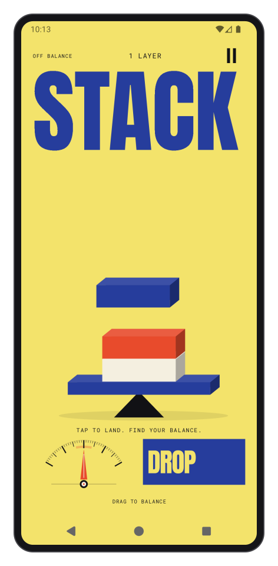
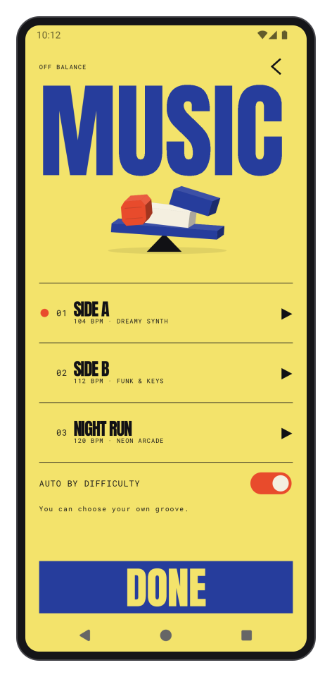
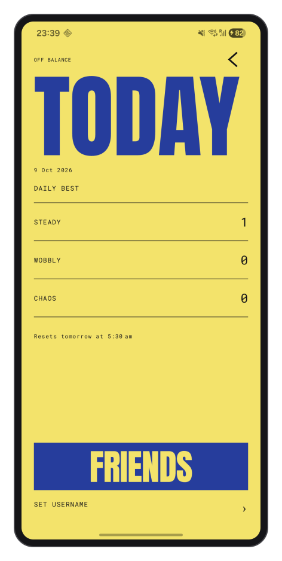
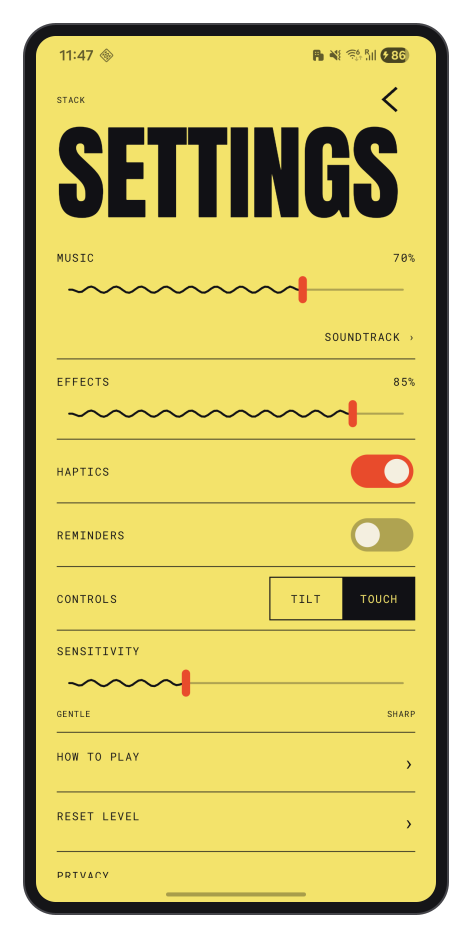

# Stack

**Tap, tilt, recover.**

A stacking game with a movable base, geometric towers, and original electro music.
Land the next block, catch the lean, and beat your record. Play with a small device
tilt or a touch control. Built for phones and foldable screens.

<p align="center">
  
</p>

<p align="center">
  
  
  
</p>

<p align="center">
  
  
  
</p>

## Play

- Learn landing and balance through a short interactive first run, then save with Google or play as a guest.
- Tap anywhere to land a block; drag the balance control or tilt your device to catch the lean.
- Start with a forgiving slab tower; progress to mixed shapes and faster movement.
- Keep separate records across three difficulties and four practice trials.
- Start with Midnight Signal, an original dark analogue synth loop, or choose keys and arcade arrangements.
- Search a friend's username, save them, and compare records.
- Save an online profile with optional Google sign-in; guest play stays available.
- Enable play and rival reminders when you want them.

The optional Style Pack contains cosmetic themes and extra music. Availability is
controlled remotely; checkout is shown only when the catalog and purchase
verification service are ready. Core play does not require a purchase.

Choose **Try demo** during onboarding or in Settings to explore every theme and
soundtrack with sample profiles and scores. The demo uses local storage and leaves
your account, purchases, and game records intact.

## Develop

Requires **JDK 21** and **Android SDK 36**. The app supports Android 8.0 and newer.

```powershell
.\gradlew.bat testDebugUnitTest assembleDebug lintDebug
android run --apks app/build/outputs/apk/debug/app-debug.apk --activity com.stackapp.stack.MainActivity --device <serial>
```

Debug builds run with offline services by default. To connect your own Firebase
project, add a private `app/google-services.json` and build with
`-Pstack.firebaseDebug=true`. Enable guest authentication and Google sign-in,
register your signing certificates, and deploy the included database rules.
Keep service configuration, signing keys, and local environment files out of Git.

For a signed release, configure `keystore.properties` using
[the example](keystore.properties.example):

```powershell
.\gradlew.bat testDebugUnitTest lintRelease assembleRelease bundleRelease
```

### Project layout

| Path | Purpose |
| --- | --- |
| `app/src/main` | Gameplay, screens, audio, and service integration |
| `app/src/test` | Physics, camera, timing, and product-rule checks |
| `app/src/androidTest` | Device journeys and audio lifecycle checks |
| `firebase` | Security rules, remote defaults, receipt verification, and privacy page |
| `scripts` | Original asset generation and release checks |
| `media` | Actual app captures and device-frame layouts |

### Verify

Device journeys cover onboarding, rapid taps, falls and replay, backgrounding,
rotation, audio focus, username search, purchase gating, and account/review flows.
Account and purchase journeys use controlled responses and do not create public
test players. A separate QA application can exercise the journeys on a phone
without replacing the installed game or its Google session:

```powershell
$env:ANDROID_SERIAL = "<serial>"
.\gradlew.bat connectedDebugAndroidTest '-Pstack.testApplicationIdSuffix=.qa'
firebase emulators:exec --only firestore --project demo-off-balance "node firebase/tests/rules.test.mjs"
npm --prefix firebase/functions test
python scripts/check_public_source.py
```

Tests verify behavior; emulator results do not establish real-device frame rate,
battery use, or temperature. Check those on physical devices before a store release.

`PhysicalServiceTest` provides opt-in authenticated service checks. Run it against
a configured, signed `liveTest` build with `stack.testBuildType=liveTest` and the runner
arguments `class=com.stackapp.stack.PhysicalServiceTest` and `liveServices=true`.
Sign in first. These checks refresh authentication, require App Check, verify the
closed store response, and reject an invalid receipt without making a purchase.
The live test build keeps the test runtime intact and is never a store artifact.

### Online services

Deploy the security rules and indexes before enabling online competition. Remote
defaults control bundled features, optional offers, review opportunities, and
reminders. Cached settings support offline play; changes activate at safe app
boundaries. Sales stay off unless both payment and verification controls are on.

The purchase service requires an active Google Play product, Android Publisher API
access, App Check, and a supported function deployment plan. The service verifies
and acknowledges receipts; pending payments never unlock content. Restore remains
available for previously owned content when new sales are disabled.

### Contribute

Keep changes focused and include a reproducible case for behavior fixes. Run the
checks relevant to the change, exercise phone and unfolded layouts for UI work,
and include screenshots when the visual result changes. Do not commit private
configuration, credentials, personal data, or local documentation directories.

[Privacy](https://stack-damercy.web.app/privacy) · [Asset credits](app/src/main/assets/ASSET_SOURCES.md) · [Issues](https://github.com/Damercy/Stack/issues)
