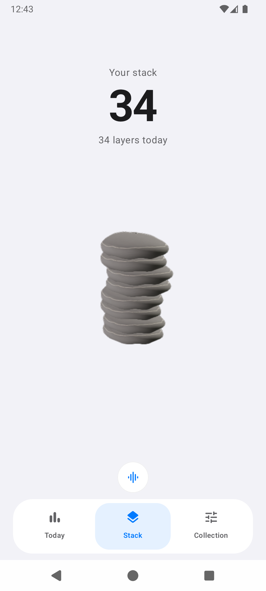
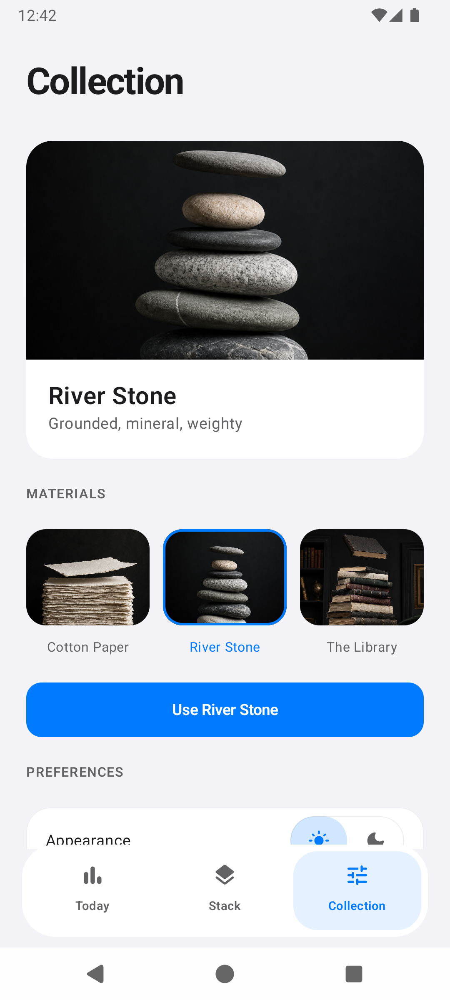
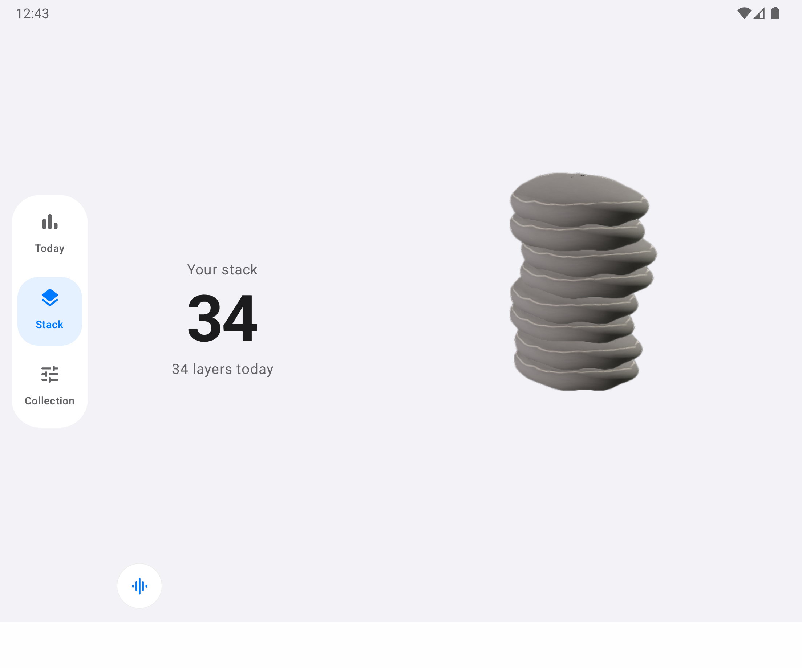

# Stack

Tap. Hear a note. Build something beautiful.

A quiet stacking game for Android. Layer paper, balance stones, or build a library—one tap at a time.

<p>
  
  
  
</p>

## A small daily ritual

- Three tactile materials, each with its own character.
- A collection of musical tones and subtle haptics.
- Daily progress and a leaderboard.
- Light and dark appearance, with layouts for phones and larger screens.



## Build

Built with Kotlin, Jetpack Compose, Room, and Filament.

Requires JDK 21 and Android SDK 36. Configure `JAVA_HOME` and `ANDROID_HOME`, then run:

```powershell
.\gradlew.bat testDebugUnitTest assembleDebug
android run --apks app/build/outputs/apk/debug/app-debug.apk --activity com.stackapp.stack.MainActivity
```

Debug builds work with local data. To enable Firebase in debug, provide your own `app/google-services.json` and use `-Pstack.firebaseDebug=true`. Keep service configuration and signing credentials outside version control.

[Privacy](https://stack-damercy.web.app/privacy) · [Asset credits](app/src/main/assets/ASSET_SOURCES.md)
