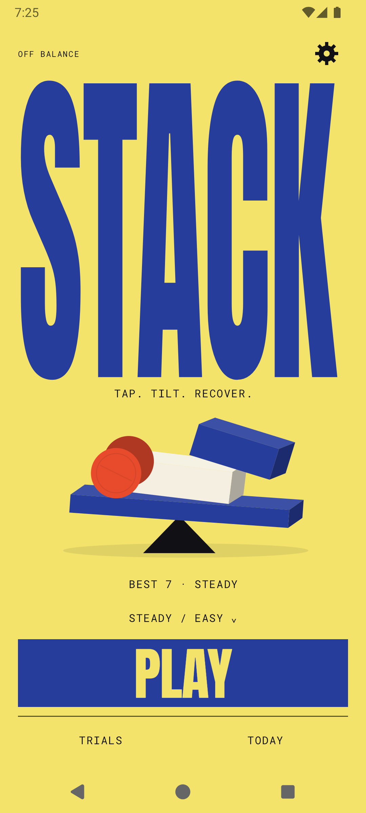
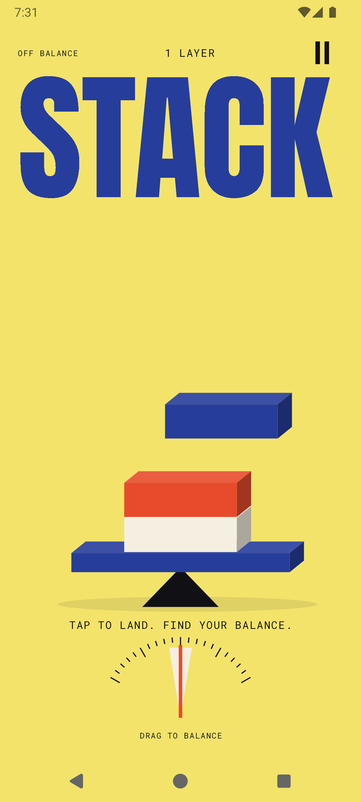
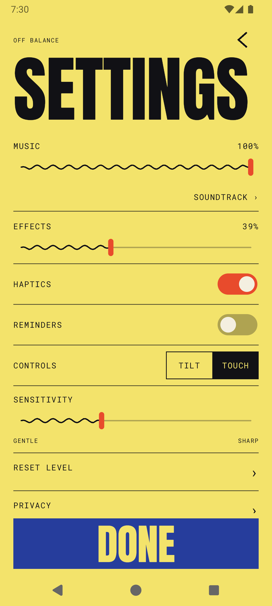

# Off Balance

**Tap. Tilt. Recover.**

A playful stacking game for Android. Drop slabs, balance discs, and save a leaning
tower with a small tilt—or use touch controls. Bold poster typography, springy
motion, and original electro grooves keep every run moving.

<p>
  
  
  
</p>

- Three difficulties, with separate records.
- Four short trials that teach by playing.
- Tilt calibration and a touch alternative.
- Three free electro loops, plus a cosmetic pack with three themes and three extra grooves.
- Daily records and saved friends to compete with.
- Username search and an optional public profile.
- Optional play and rival reminders.
- Adaptive phone and larger-window layouts.


## Build

Kotlin, Jetpack Compose, Navigation 3, Room, and JBox2D. The scene uses lightweight
geometric extrusion with independent rigid-body contacts on one balance axis.
Physics advances at a fixed 60 Hz; drawing follows the display clock with a 60 Hz cap.
Audio buffers and database work run off the UI thread. A pivot-anchored camera eases
out as the tower grows without removing its lower layers.

Requires JDK 21 and Android SDK 36:

```powershell
.\gradlew.bat testDebugUnitTest assembleDebug lintDebug
android run --apks app/build/outputs/apk/debug/app-debug.apk --activity com.stackapp.stack.MainActivity
```

Signing credentials and service configuration belong outside version control.

Online competition uses Firebase Authentication and Firestore. Supply your own
private `app/google-services.json`; enable anonymous sign-in and deploy the included
security rules. Debug builds use offline services unless `-Pstack.firebaseDebug=true`
is supplied. No sample players are shown in the product.

Firebase Remote Config controls optional offer placement, run thresholds, cooldowns,
celebrations, trials, friends, and opt-in reminders. The included template defaults
all purchase and offer controls to off. Cached settings work offline; fetched changes
activate at navigation or resume boundaries. Controls only enable bundled features.

The nonconsumable Style Pack uses Play Billing and server receipt verification.
Deployable functions require Firebase Blaze, Android Publisher API access for the
managed service account, an active Play product, and App Check configuration.
Checkout stays unavailable until both remote controls and the catalog/backend are
ready. Purchase verification and acknowledgement run on the server; pending payments
never grant access. Restoring owned content does not require sales to be enabled.

Device journeys cover gameplay, interruptions, audio, navigation, and friends:

```powershell
.\gradlew.bat connectedDebugAndroidTest
firebase emulators:exec --only firestore --project demo-off-balance "node firebase/tests/rules.test.mjs"
```

[Privacy](https://stack-damercy.web.app/privacy) · [Asset credits](app/src/main/assets/ASSET_SOURCES.md)
